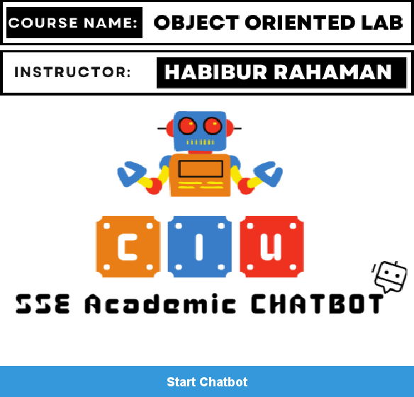
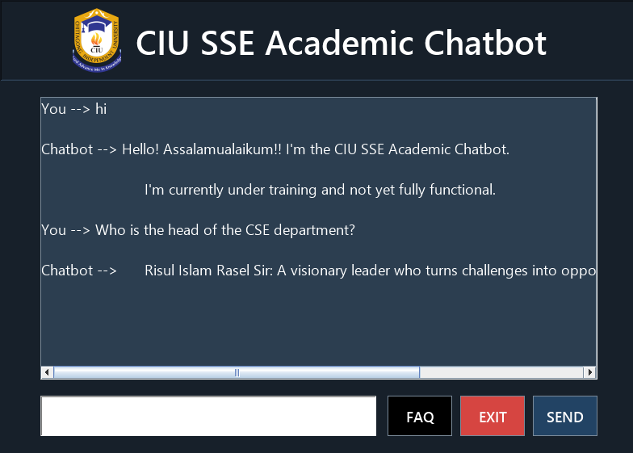
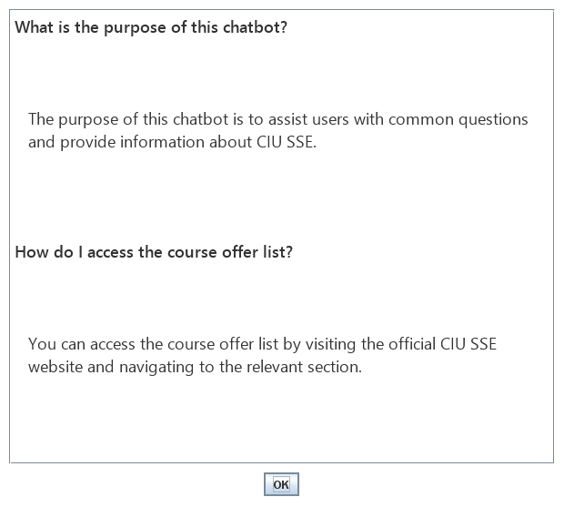

# CIU SSE Academic Chatbot

A desktop chatbot for students of the School of Science and Engineering (SSE) at Chittagong Independent University. You type a question, and it answers from a set of keywords or opens the document you asked for, such as the course offer list, the tuition fee chart or a faculty profile.

I built it in Java with Swing as the project for my Object Oriented Programming Lab course.

## Screenshots

Welcome screen



Chat window



FAQ



## Features

- Welcome screen with a Start button (Enter works too)
- Chat window with a "Chatbot is typing..." delay before each reply
- Keyword based answers on scholarships, courses, tuition fees, grading, faculty members and project formats
- Opens the related PDF or Word file in the default viewer when a question needs a document
- FAQ window with questions grouped by category
- Asks for a star rating when you exit

## Things you can ask

| Type something with | The chatbot will |
| --- | --- |
| `hi`, `hello` | Greet you |
| `scholarship` | Explain the scholarship categories and the required results |
| `course offer list`, `course` | Open the course offer list |
| `cse 101` | Open the course outline |
| `tution` | Open the tuition fee details |
| `grading` | Open the grading policy |
| `faculty` | Open the list of faculty members |
| `dean`, `head`, or the name of a faculty member | Introduce them and open their profile |
| `project report`, `project` | Open the project report format or the proposal format |

Matching is not case sensitive. If nothing matches, the chatbot says that it could not understand the question.

## Project structure

```
pom.xml
src/main/java/com/mycompany/chatbotdemo/
    ChatbotDemo.java         entry point, starts the app
    ChatbotInterface.java    welcome screen
    Chatbot.java             chat window, replies, FAQ and rating
src/main/resources/images/   logo and welcome screen artwork
documents/                   files the chatbot opens (not included, see below)
screenshots/
```

## How to run

You need JDK 8 or newer.

**NetBeans:** open the folder with File > Open Project and press Run.

**Maven:**

```bash
mvn compile exec:java
```

**Plain JDK**, from the project folder:

```bash
javac -encoding UTF-8 -d out src/main/java/com/mycompany/chatbotdemo/*.java
```

```bash
cp -r src/main/resources/images out/
```

```bash
java -cp out com.mycompany.chatbotdemo.ChatbotDemo
```

## Documents

Some answers open a file from the `documents` folder. Those files are university documents, so they are not part of this repository. The chatbot still runs without them; it just gives the text reply and skips the file.

To use that feature, put your own files in `documents` with the names listed in [documents/README.md](documents/README.md).

## OOP concepts used

- **Inheritance:** `Chatbot` and `ChatbotInterface` both extend `JFrame`
- **Encapsulation:** the UI components and helper methods of each window are private to its class
- **Polymorphism:** event handling through `ActionListener`, `KeyListener` and `FocusListener` implementations, and an overridden `paintComponent` for the welcome screen background
- **Abstraction:** each window is its own class, and the reply logic sits behind a single `generateReply` method

## Limitations

The replies are matched by keyword, so the chatbot only knows what has been written into it. Adding a new answer means adding one more keyword check in `generateReply`.

## Author

Md. Musfiqur Rahman Akib  
Department of Computer Science and Engineering, Chittagong Independent University  
[mdmusfiqurrahmanakib.github.io](https://mdmusfiqurrahmanakib.github.io)
